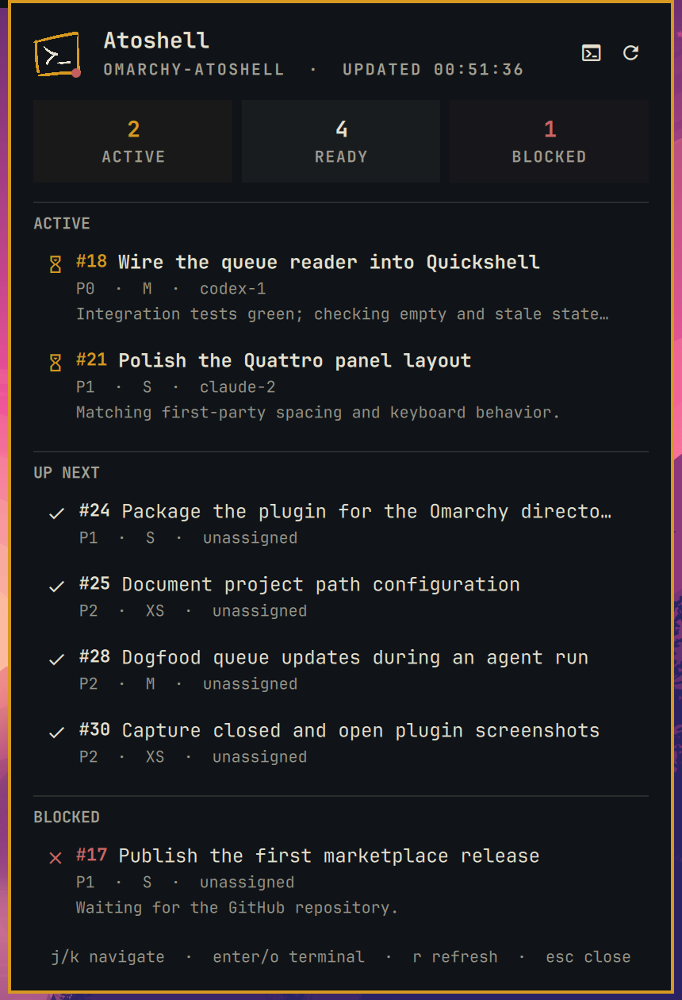
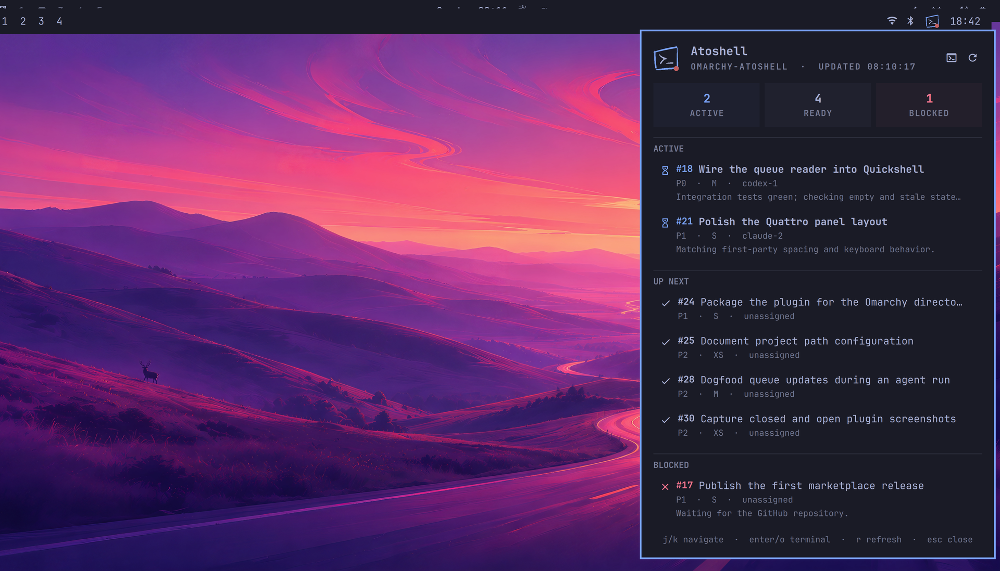

# Atoshell Queue for Omarchy

A small, read-only Omarchy Quattro panel for watching an Atoshell queue while coding agents work.

## Screenshots

**Open panel — dark theme with a gold accent:**



**Quattro overview — Tokyo Night with the winding-road background:**



**Taskbar detail — light theme with a blue accent:**


These three captures show one example of each useful view rather than repeating every state/theme combination. They are rendered from the real plugin QML through Quickshell's Qt OpenGL/RHI scenegraph with representative queue data—not HTML mockups. Each checked-in PNG retains two source pixels per intended README display pixel; the taskbar source was rendered at compositor scale 16. GitHub receives the HiDPI assets with explicit display widths rather than enlarging low-resolution crops.

The runtime mark preserves the canonical hand-drawn paths: only its outer frame follows the active theme accent, while the inner `>_` follows the normal foreground. The fixed green-and-white SVG and 128×128 PNG remain the standalone Atoshell brand assets.

## What v1 shows

- **Active** tickets first, with the accountable agent and latest progress comment
- **Up next** tickets in Atoshell's ranked order
- **Blocked** tickets called out with the theme's urgent color
- Full-queue counts in the bar tooltip and panel summary
- Last refresh time, loading, empty, configuration-error, and stale-data states
- Theme-native mouse and keyboard navigation

This is deliberately an observability surface, not another ticket editor. Atoshell remains the only owner of queue semantics and data.

## Requirements

- Omarchy Quattro / v4.0.0 or newer
- [Atoshell](https://github.com/GeekKingCloud/atoshell) available on `PATH`
- `jq`
- GNU `timeout` (provided by `coreutils` on Omarchy)
- One Atoshell project directory to monitor

Install Atoshell separately if needed:

```bash
curl -fsSL https://raw.githubusercontent.com/GeekKingCloud/atoshell/main/install.sh | bash
```

## Install

Once this repository is published:

```bash
omarchy plugin add https://github.com/GeekKingCloud/atoshell-omarchy.git --enable
```

For local development, link the checkout into Omarchy's third-party plugin directory, then rescan:

```bash
mkdir -p ~/.config/omarchy/plugins
ln -s "$PWD" ~/.config/omarchy/plugins/geekkingcloud.atoshell
omarchy-shell shell rescanPlugins
omarchy plugin enable geekkingcloud.atoshell
```

Omarchy's publisher validator rejects symlinks *inside* plugins; linking the checkout as the plugin root is the documented development path and removal unlinks it safely.

## Remove

For a normal Git-installed plugin:

```bash
omarchy plugin remove geekkingcloud.atoshell
```

For the local-development link shown above, the same command removes the plugin registration and unlinks the checkout without deleting the checkout itself.

## Configure

The plugin finds the real Atoshell executable through `PATH`; it does not embed or duplicate Atoshell. Open **Setup → Plugins → Atoshell Queue** and choose the folder containing `.atoshell`. The helper runs the installed `atoshell` command from that project directory and reads its documented JSON output.

Settings:

| Setting | Default | Purpose |
|---|---:|---|
| Atoshell project | `~` | Project folder to monitor; `~` intentionally produces a setup prompt unless it is an Atoshell project |
| Background refresh | 15 s | Idle bar refresh; an open panel refreshes every 3 seconds |
| Tickets per section | 5 | Maximum visible rows for Active, Up Next, and Blocked |

## Interaction

- Left-click the bar icon: open or close the queue panel
- Right- or middle-click the bar icon: refresh without opening
- Mouse wheel or trackpad: scroll the single ticket list through Active, Up Next, and Blocked
- `j` / `k` or Up / Down: move the selected visible ticket
- `r` or the refresh button: refresh now
- `o`, `t`, Enter, or the terminal button: open a terminal in the configured project directory
- Escape: close the panel

The Active, Ready, and Blocked cards are summary counts, not filters. Selecting a ticket is navigation only in v1; it does not open or mutate the ticket. Ticket changes still go through the `atoshell` CLI. The UI never calls `take`, `move`, `done`, or any other write command.

## Architecture

```text
Omarchy bar/panel
      │
      ▼
Service.qml ── Process argv ── bin/atoshell-snapshot
                                  │
                                  ├─ atoshell list in-progress --json
                                  ├─ atoshell list ready --json
                                  └─ atoshell list blockers --json
```

The helper emits one stable JSON envelope. It derives blocked downstream tickets from Atoshell's blocker relationships, excludes blocked Ready tickets from Up Next, preserves the ranked order, and names each blocking prerequisite. An in-progress ticket remains in Active but receives the same urgent marker and “Blocked by” explanation when a prerequisite is unresolved. The helper never reads `.atoshell` files directly. Every CLI read has a ten-second timeout; on any failed refresh the service keeps the last good snapshot visible and marks it stale.

## Development

```bash
bash tests/test-snapshot.sh
python3 tests/test-contract.py
QT_QPA_PLATFORM=offscreen QT_QUICK_BACKEND=software qmlscene tests/model-smoke.qml
shellcheck -x bin/atoshell-snapshot tests/test-snapshot.sh
omarchy plugin validate .
```

See [`docs/design-research.md`](docs/design-research.md) for the source-backed UI decisions and [`docs/preview.html`](docs/preview.html) for the deterministic visual reference.

## Security and privacy

Omarchy plugins are unsandboxed QML inside the long-lived shell. This plugin therefore keeps its attack surface intentionally small:

- commands use Quickshell's argv-array `Process` API, not interpolated shell strings;
- the project path is passed as one argument and changed into with `cd --`;
- no network access, credentials, telemetry, database, or install hook;
- returned titles/comments use `Text.PlainText`, and dynamic labels passed into shared AutoText components are neutralized first;
- refreshes are read-only;
- transient failures preserve known data rather than pretending the queue is empty.

The configured project is a trust boundary: Atoshell reads that project's local configuration with your user account. Point the plugin only at projects you trust.

Review any plugin before enabling it, including this one.

## License

MPL-2.0
